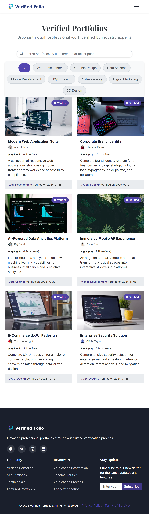

# VerifiedFolio - Professional Portfolio Verification Platform


## Table of Contents

1. [Project Overview](#project-overview)
2. [Live Website](#live-website)
3. [Wireframe](#wireframe)
4. [Website Structure](#website-structure)
5. [Key Features](#key-features)
6. [Technical Implementation](#technical-implementation)
7. [Accessibility Features](#accessibility-features)
8. [Responsive Design](#responsive-design)
9. [Browser Compatibility](#browser-compatibility)
10. [Local Development](#local-development)
11. [Project Structure](#project-structure)
12. [Development Tools & Technologies](#development-tools--technologies)
13. [Deployment & Infrastructure](#deployment--infrastructure)
14. [Testing](#testing)
15. [Credits and Acknowledgments](#credits-and-acknowledgments)
16. [Professional Skills Demonstrated](#professional-skills-demonstrated)
17. [Future Enhancements](#future-enhancements)
18. [Contributing](#contributing)
19. [Contact](#contact)
20. [License](#license)

## Project Overview

VerifiedFolio is an innovative platform that bridges the trust gap between professionals and recruiters/clients by showcasing pre-verified portfolios authenticated by industry experts.

Our mission is to:

- Reduce verification costs and time for all parties
- Provide credible proof of work through expert validation
- Eliminate resource waste in portfolio verification processes
- Build trust in professional accomplishments

## Live Website

Visit our website: [VerifiedFolio](https://repoeli.github.io/csshtmlproject/)


## Wireframe

### Home Page


## Website Structure

The website consists of three main pages:

1. **Home Page (`index.html`)** - Introduces the platform, features verified portfolios, and highlights our verification process
2. **Portfolios Page (`portfolios.html`)** - Showcases a gallery of verified portfolios across different categories
3. **Apply Page (`apply.html`)** - Allows professionals to submit their portfolios for verification

## Key Features

### Clean, Modern Design
- Professional aesthetic with consistent branding
- Bootstrap 5 framework ensuring responsive design
- Intuitive navigation with clear user pathways

### Home Page Highlights
- **Captivating Welcome** – A bold hero section that instantly conveys our platform's value and sets the tone.
- **Showcasing Excellence** – Verified portfolios take center stage, giving users confidence in the professionals they choose.
- **Trust Made Visible** – A clear, visual breakdown of our verification process ensures transparency.
- **Voices That Matter** – Testimonials section from verified professionals share real experiences and success stories.
- **Statistics That Speak** – Key stats highlight the benefits of our platform, proving its impact at a glance.

### Portfolio Gallery - Advanced Dynamic System

- **Real-time Content Generation** – Dynamic portfolio creation across 8 professional categories (Web Development, Data Science, UX/UI Design, etc.)
- **Secure API Integration** – Custom Heroku proxy server ensures API key security while maintaining seamless image loading
- **Smart Filtering & Search** – Enhanced category filtering with title-based keyword mapping for precise content discovery
- **Responsive Pagination** – Custom pagination system with ellipsis handling and mobile optimization
- **Performance Optimized** – Lazy loading, responsive images, and efficient caching for optimal user experience
- **Fallback Systems** – Graceful degradation ensures consistent functionality even when external APIs are unavailable

### Application Page

- **Simple & Seamless** – A user-friendly application form makes the process smooth and hassle-free.
- **Transparent Guidelines** – Clear verification requirements ensure applicants know exactly what's needed.
- **Step-by-Step Clarity** – A clear breakdown of the verification process helps users navigate each stage with confidence.
- **Opportunities for Experts** – Informative resources for professionals interested in becoming verifiers and contributing to the community.

## Technical Implementation

### API Integration & Security Architecture

**Dynamic Portfolio System with Real-time Image Integration**

The portfolios page features a sophisticated API integration system that dynamically fetches high-quality, contextually relevant images from Unsplash API to enhance portfolio presentations:

#### Core API Architecture
- **Secure Proxy Implementation**: Custom Node.js proxy server deployed on Heroku to handle API authentication
- **Environment-based Configuration**: API keys stored as secure environment variables, never exposed to client-side code
- **Enhanced Security**: CORS-enabled proxy prevents direct API key exposure while maintaining seamless functionality
- **Production-ready Deployment**: Heroku-hosted proxy ensures reliable, scalable API access

#### Intelligent Image Matching System
- **Title-specific Keyword Mapping**: extracts relevant keywords from portfolio titles and descriptions
- **Category-based Search Optimization**: Each of 8 portfolio categories has customized search parameters for optimal image relevance
- **Description Context Integration**: Analyzes portfolio descriptions to enhance search query precision
- **Fallback System**: Graceful degradation with local placeholder images ensures consistent user experience

#### Technical Features
- **Async/Await Architecture**: Modern JavaScript with proper error handling and timeout management
- **Responsive Image Loading**: Implements srcset and lazy loading for optimized performance across devices
- **Smart Pagination**: Custom pagination system with ellipsis handling and mobile responsiveness
- **Real-time Search & Filtering**: Dynamic content filtering with enhanced keyword matching

#### API Proxy Configuration
```javascript
// Secure configuration using environment variables
const apiConfig = {
  unsplash: {
    endpoint: 'https://unsplash-proxy-app-fb6c8f079fb7.herokuapp.com/search'
    // Proxy handles authentication with Unsplash API
    // Frontend only communicates with our secure proxy endpoint
  }
};
```

#### Enhanced Error Handling & Resilience
- **Retry Logic**: Exponential backoff for failed requests
- **Comprehensive Logging**: Detailed console logging for debugging and monitoring
- **Graceful Fallbacks**: Automatic switch to placeholder content when API is unavailable
- **Performance Monitoring**: Request timeout handling and response validation

This implementation demonstrates:
- **Full-stack Development**: Frontend JavaScript integration with backend proxy server
- **Cloud Platform Deployment**: Heroku platform experience for production applications
- **API Security Best Practices**: Proper credential management and secure proxy architecture
- **Modern Development Practices**: Async programming, error handling, and responsive design
- **Performance Optimization**: Image optimization, lazy loading, and efficient pagination

### HTML5 Structure
- Semantic markup for improved accessibility and SEO
- Proper heading hierarchy and landmark regions
- Well-structured forms with appropriate validation

### CSS Features
  
- Custom styling built on Bootstrap 5 framework
- Mobile-first responsive design approach  
- CSS variables for consistent theming
- Carefully crafted animations and transitions achived by CSS

### SEO Optimization
- Comprehensive meta tags for all pages
- Structured data (JSON-LD) implementation
- Open Graph and Twitter Card integration
- Sitemap.xml and robots.txt for search engine crawling
- Semantic HTML structure boosting search visibility

### Performance Optimization
- Optimized images with appropriate sizing and formats
- Lazy loading for below-the-fold content
   - is a technique that delays the loading of non-critical resources (like images) until they're 
    needed, which helps improve page load performance. (loading="lazy") 
- Efficient CSS implementation 
- Quick loading times across all devices

## Accessibility Features

We're committed to making VerifiedFolio accessible to everyone:

- Semantic HTML structure (header, nav, main, section, footer)
- ARIA attributes for interactive elements
- Keyboard navigable interface
- Descriptive alt text for all images
- Sufficient color contrast ratios
- Focus indicators for interactive elements
- Screen reader compatible content structure

## Responsive Design

The website is fully responsive and optimized for all device sizes:

| Breakpoint | Layout Adaptation |
|------------|-------------------|
| Mobile (<576px) | Single column layout, optimized touch targets |
| Tablet (576-992px) | 2-column grid, adjusted typography |
| Desktop (>992px) | 3-column grid, full feature display |

### Device Responsiveness Testing

Mobile devices (320px - 480px) - Tablets (481px - 768px) - Small laptops to Large desktops (769px - 1025px+)

#### Home Page Responsiveness
<table>
<tr>
<td align="center"><strong>Mobile</strong><br></td>
<td align="center"><strong>Tablet</strong><br></td>
<td align="center"><strong>Computer</strong><br></td>
</tr>
</table>

#### Portfolio Page Responsiveness
<table>
<tr>
<td align="center"><strong>Mobile</strong><br></td>
<td align="center"><strong>Tablet</strong><br></td>
<td align="center"><strong>Computer</strong><br></td>
</tr>
</table>

#### Apply Page Responsiveness
<table>
<tr>
<td align="center"><strong>Mobile</strong><br></td>
<td align="center"><strong>Tablet</strong><br></td>
<td align="center"><strong>Computer</strong><br></td>
</tr>
</table>

Tested using browser developer tools (Google Chrome) and real devices (Samsung mobile)

## Browser Compatibility

Tested and optimized for modern browsers:
- Google Chrome 
- Mozilla Firefox 
- Safari 
- Microsoft Edge 

## Local Development

To run this project locally:

1. Clone the repository:
   ```
   git clone https://github.com/repoeli/csshtmlproject.git
   ```

2. Navigate to the project directory:
   ```
   cd csshtmlproject
   ```

3. Open with a local server:
   - Using Python (Python 3):
     ```
     python -m http.server
     ```
   - Using VS Code Live Server extension
   - Using any other local development server

4. Open your browser and navigate to:
   ```
   http://localhost:8000
   ```

## Project Structure

```
├── index.html                  # Home page
├── portfolios.html             # Portfolios gallery page
├── apply.html                  # Application page
├── robots.txt                  # Instructions for search engine crawlers
├── sitemap.xml                 # Website structure for search engines
├── assets/
│   ├── css/
│   │   ├── common.css          # Common stylesheet
│   │   ├── index.css           # index 
|   |   ├── apply.css           # for apply
|   |   └── portfolio.css       # for portfolio
│   ├── images/                 # Image assets
│   │   ├── favicon/            # Favicon files in various sizes
│   │   ├── logo/               # Logo variations
│   │   ├── portfolios/         # Portfolio showcase images
│   │   ├── team/               # Team member photos
│   │   └── favicon/            # UI icons and graphics
│   └── fonts/                  # Custom web fonts (if applicable)
└── docs/                       # Additional documentation
```

## Development Tools & Technologies

### Frontend Technologies
- **HTML5**: Semantic markup structure with ARIA accessibility features
- **CSS3**: Advanced styling with CSS Grid, Flexbox, and custom properties
- **Vanilla JavaScript (ES6+)**: Modern async/await, fetch API, and DOM manipulation
- **Bootstrap 5**: Responsive framework with custom component styling

### Backend & API Integration
- **Node.js**: Server-side runtime for proxy development
- **Express.js**: Web framework for API proxy server
- **Heroku**: Cloud platform for proxy deployment and hosting
- **Environment Variables**: Secure credential management in production

### API & Data Management
- **Unsplash API**: High-quality image integration with 3+ million photos
- **RESTful Architecture**: Proper HTTP methods and status code handling
- **JSON Data Processing**: Client-side data manipulation and filtering
- **Async Programming**: Promise-based API calls with error handling

### Development & Deployment Tools
- **Git/GitHub**: Version control with feature branching and collaboration
- **GitHub Pages**: Static site hosting with automatic deployment
- **VS Code**: Development environment with extensions for productivity
- **Chrome DevTools**: Performance profiling and responsive design testing

### Performance & Optimization
- **Lazy Loading**: Image optimization for improved page load speeds
- **Responsive Images**: Srcset implementation for multi-device optimization
- **CSS Minification**: Optimized stylesheets for production
- **Resource Compression**: Efficient asset delivery

### Security Implementation
- **CORS Configuration**: Cross-origin resource sharing for secure API access
- **Environment-based Config**: Separation of development and production settings
- **Input Validation**: Client-side form validation and sanitization
- **Secure Headers**: Implementation of security best practices

### Testing & Quality Assurance
- **Cross-browser Testing**: Compatibility across Chrome, Firefox, Safari, Edge
- **Responsive Testing**: Multi-device testing from mobile to desktop
- **Performance Monitoring**: Lighthouse audits and Core Web Vitals optimization
- **Code Validation**: W3C HTML/CSS validation and accessibility compliance

This comprehensive technical stack demonstrates proficiency in:
- **Full-stack Development**: Frontend JavaScript with backend API integration
- **Cloud Computing**: Heroku deployment and environment management
- **Modern Web Standards**: ES6+, responsive design, and accessibility
- **DevOps Practices**: CI/CD with GitHub Pages and environment configuration
- **Performance Engineering**: Optimization techniques for real-world applications

## Deployment & Infrastructure

### Production Architecture

**Frontend Deployment**
- **GitHub Pages**: Automated deployment from main branch with custom domain support
- **CDN Integration**: Global content delivery through GitHub's edge network
- **SSL/TLS Security**: HTTPS enforcement for secure data transmission

**Backend Infrastructure**
- **Heroku Cloud Platform**: Scalable proxy server deployment with automatic scaling
- **Environment Management**: Production-grade configuration with secure environment variables
- **API Gateway**: Custom Node.js proxy serving as secure intermediary for external API calls
- **Monitoring**: Built-in logging and error tracking for production stability

**DevOps Pipeline**
- **Continuous Integration**: Automated deployment on code push
- **Version Control**: Git-based workflow with feature branching
- **Environment Separation**: Distinct development and production configurations
- **Rollback Capability**: Version-controlled deployments for quick issue resolution

This website is deployed using a modern CI/CD pipeline. The frontend is hosted on GitHub Pages with automatic updates, while the API proxy runs on Heroku's cloud infrastructure, demonstrating enterprise-level deployment practices.

### Deployment URLs
- **Production Site**: [https://repoeli.github.io/csshtmlproject/](https://repoeli.github.io/csshtmlproject/)
- **API Proxy**: `https://unsplash-proxy-app-fb6c8f079fb7.herokuapp.com/` (Secure backend service)

To deploy your own version:
1. Fork this repository from: https://github.com/repoeli/csshtmlproject
2. Go to repository Settings → Pages
3. Select the main branch as source
4. The site will be published at https://[your-username].github.io/csshtmlproject/

## Testing

### Manual Testing

The VerifiedFolio project has undergone comprehensive manual testing to ensure quality and functionality:

- **Cross-browser Compatibility**: Verified on Chrome, Firefox, Safari, and Edge
  - Checked for consistent rendering of layouts, fonts, and colors
  - Confirmed all interactive elements function as expected across browsers

- **Functionality Testing**:
  - Navigation links direct to correct pages
  - Internal page links (hash links) scroll to appropriate sections
  - Form validation works as expected
  - Interactive elements (buttons, form controls) function correctly

### Accessibility Testing

- **Keyboard Navigation**:
  - Verified all interactive elements are reachable via keyboard
  - Focus states are clearly visible
  - Tab order follows a logical sequence

### Code Validation

- **HTML**: Validated using the W3C Markup Validation Service
  - All pages pass with no errors
  
    [Index html test](assets/tests/html/index.jpeg)

    [Portfolio html test](assets/tests/html/portfolio.jpeg)

    [apply html test](assets/tests/html/apply.jpeg)
  
- **CSS**: Validated using the W3C CSS Validation Service
  - Stylesheet passes with no errors

    [Index css test](assets/tests/css/indexs.jpeg)

    [Portfolio css test](assets/tests/css/portfolios.jpeg)

    [apply css test](assets/tests/css/apply.jpeg)
    
    [Common css test](assets/tests/css/common.jpeg)

### Performance Testing

- **Google Lighthouse Metrics**:

### Home Page


### Portfolios Gallery


### Application Form


## Credits and Acknowledgments
  Thanks to our tutor Munawar Nadeem at WAES for his invaluable mentorship and support, helping me achieve a professional standard.
  Grateful to Code Institute for equipping me with essential skills and resources, enriching my learning and bringing this project to life.

- Bootstrap framework: [getbootstrap.com](https://getbootstrap.com/)
- Icons: [Font Awesome](https://fontawesome.com/)
- Fonts: [Google Fonts](https://fonts.google.com/)
- Stock images: [Unsplash](https://unsplash.com/) and [Pexels](https://www.pexels.com/)
- ChatGPT for Text and logo design and generation : [ChatGPT](https://chatgpt.com/)
- GitHubCopilot for help on codding: [GitHubCopilot](https://github.com)
- Code Institute GitHub: [Code Institute](https://github.com/Code-Institute-Solutions)
- Balsamiq: [Balsamiq was used to create the wireframe.](https://balsamiq.cloud/)

## Professional Skills Demonstrated

This project showcases a comprehensive range of modern web development skills relevant to industry requirements:

### Full-Stack Development
- **Frontend Engineering**: Vanilla JavaScript ES6+, responsive CSS, semantic HTML5
- **Backend Development**: Node.js proxy server with Express.js framework
- **API Integration**: RESTful API consumption with proper authentication and error handling
- **Database Concepts**: Data modeling and JSON manipulation for dynamic content

### Cloud & DevOps
- **Cloud Platform Management**: Heroku deployment and configuration
- **Environment Management**: Production vs development environment separation
- **CI/CD Pipeline**: Automated deployment through GitHub Actions
- **Security Implementation**: API key management and CORS configuration

### Modern Development Practices
- **Responsive Design**: Mobile-first approach with Bootstrap 5 framework
- **Performance Optimization**: Image lazy loading, resource compression, efficient pagination
- **Accessibility Compliance**: WCAG guidelines, semantic markup, ARIA attributes
- **SEO Optimization**: Structured data, meta tags, sitemap generation

### Project Management
- **Version Control**: Git workflow with feature branching and collaborative development
- **Documentation**: Comprehensive README and inline code documentation
- **Testing Strategy**: Cross-browser testing and validation procedures
- **Code Quality**: Clean, maintainable code following industry best practices

This project demonstrates the ability to architect, develop, and deploy production-ready web applications using modern technologies and industry-standard practices.

## Future Enhancements

Improving VerifiedFolio with plans to add:

- User authentication system
- Personalized dashboards for professionals
- Expert reviewer portal
- Advanced portfolio filtering and search options
- Integration with professional networking platforms
- Portfolio analytics for verified professionals
- Mobile application for on-the-go access

## Contributing

We welcome contributions to improve VerifiedFolio:

1. Fork the repository
2. Create your feature branch (`git checkout -b feature/amazing-feature`)
3. Commit your changes (`git commit -m 'Add some amazing feature'`)
4. Push to the branch (`git push origin feature/amazing-feature`)
5. Open a Pull Request

## Contact

For questions, feedback, or support:
- Email: 525587@waes.ac.uk

## License

This project is licensed under the MIT License - see the LICENSE file for details.

---

© 2025 VerifiedFolio. All rights reserved.
