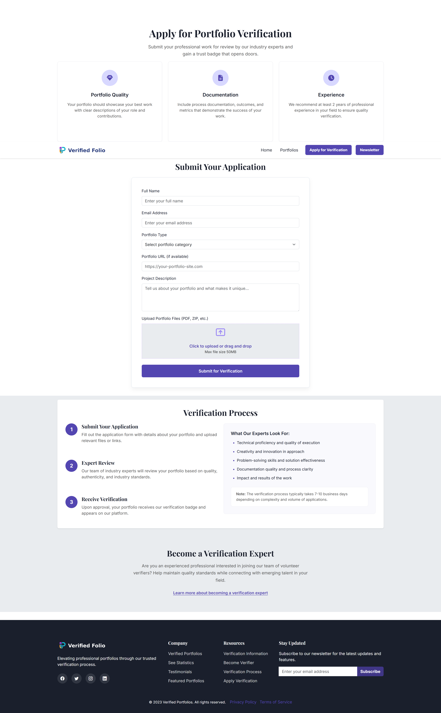

# VerifiedFolio - Professional Portfolio Verification Platform


## Project Overview

VerifiedFolio is an innovative platform that bridges the trust gap between professionals and recruiters/clients by showcasing pre-verified portfolios authenticated by industry experts.

Our mission is to:

- Reduce verification costs and time for all parties
- Provide credible proof of work through expert validation
- Eliminate resource waste in portfolio verification processes
- Build trust in professional accomplishments

## Live Website

Visit our website: [VerifiedFolio](https://repoeli.github.io/csshtmlproject/)
## Screenshots

### Home Page


### Portfolios Gallery


### Application Form


## Website Structure

The website consists of three main pages:

1. **Home Page (`index.html`)** - Introduces the platform, features verified portfolios, and highlights our verification process
2. **Portfolios Page (`portfolios.html`)** - Showcases a gallery of verified portfolios across different categories
3. **Apply Page (`apply.html`)** - Allows professionals to submit their portfolios for verification

## Key Features

### Clean, Modern Design
- Professional aesthetic with consistent branding
- Bootstrap 5 framework ensuring responsive design
- Intuitive navigation with clear user pathways

### Home Page Highlights
- Engaging hero section with value proposition
- Featured portfolios showcase with verification badges
- Visual verification process explanation
- Testimonials from verified professionals
- Key statistics highlighting platform benefits

### Portfolio Gallery
- Filterable portfolio cards by category
- Detailed portfolio information with verification status
- Rating system showing portfolio credibility
- Responsive grid layout adapting to all device sizes

### Application System
- User-friendly application form
- Clear guidelines for verification requirements
- Step-by-step explanation of the verification process
- Information for experts interested in becoming verifiers

## Technical Implementation

### HTML5 Structure
- Semantic markup for improved accessibility and SEO
- Proper heading hierarchy and landmark regions
- Well-structured forms with appropriate validation

### CSS Features
- Custom styling built on Bootstrap 5 framework
- Mobile-first responsive design approach
- CSS variables for consistent theming
- Carefully crafted animations and transitions achived by CSS

### SEO Optimization
- Comprehensive meta tags for all pages
- Structured data (JSON-LD) implementation
- Open Graph and Twitter Card integration
- Sitemap.xml and robots.txt for search engine crawling
- Semantic HTML structure boosting search visibility

### Performance Optimization
- Optimized images with appropriate sizing and formats
- Lazy loading for below-the-fold content
   - is a technique that delays the loading of non-critical resources (like images) until they're 
    needed, which helps improve page load performance. (loading="lazy") 
- Efficient CSS implementation 
- Quick loading times across all devices

## Accessibility Features

We're committed to making VerifiedFolio accessible to everyone:

- Semantic HTML structure (header, nav, main, section, footer)
- ARIA attributes for interactive elements
- Keyboard navigable interface
- Descriptive alt text for all images
- Sufficient color contrast ratios
- Focus indicators for interactive elements
- Screen reader compatible content structure

## Responsive Design

The website is fully responsive and optimized for all device sizes:

| Breakpoint | Layout Adaptation |
|------------|-------------------|
| Mobile (<576px) | Single column layout, optimized touch targets |
| Tablet (576-992px) | 2-column grid, adjusted typography |
| Desktop (>992px) | 3-column grid, full feature display |

## Browser Compatibility

Tested and optimized for modern browsers:
- Google Chrome 
- Mozilla Firefox 
- Safari 
- Microsoft Edge 

## Local Development

To run this project locally:

1. Clone the repository:
   ```
   git clone https://github.com/repoeli/csshtmlproject.git
   ```

2. Navigate to the project directory:
   ```
   cd csshtmlproject
   ```

3. Open with a local server:
   - Using Python (Python 3):
     ```
     python -m http.server
     ```
   - Using VS Code Live Server extension
   - Using any other local development server

4. Open your browser and navigate to:
   ```
   http://localhost:8000
   ```

## Project Structure

```
├── index.html                  # Home page
├── portfolios.html             # Portfolios gallery page
├── apply.html                  # Application page
├── robots.txt                  # Instructions for search engine crawlers
├── sitemap.xml                 # Website structure for search engines
├── assets/
│   ├── css/
│   │   ├── common.css          # Common stylesheet
│   │   ├── index.css           # index 
|   |   ├── apply.css           # for apply
|   |   └── portfolio.css       # for portfolio
│   ├── images/                 # Image assets
│   │   ├── favicon/            # Favicon files in various sizes
│   │   ├── logo/               # Logo variations
│   │   ├── portfolios/         # Portfolio showcase images
│   │   ├── team/               # Team member photos
│   │   └── favicon/            # UI icons and graphics
│   └── fonts/                  # Custom web fonts (if applicable)
└── docs/                       # Additional documentation
```

## Development Tools & Technologies

- **HTML5**: Semantic markup structure
- **CSS3**: Advanced styling with flexbox and grid layouts
- **Bootstrap 5**: Front-end framework for responsive design
- **JavaScript**: For interactive elements and form validation
- **Git/GitHub**: Version control and project hosting
- **GitHub Pages**: Deployment platform
- **Google Fonts**: Typography enhancement
- **Font Awesome**: Icon library

## Deployment

This website is deployed using GitHub Pages from the main branch. When changes are pushed to the main branch, the site is automatically updated.

To deploy your own version:
1. Fork this repository from: https://github.com/repoeli/csshtmlproject
2. Go to repository Settings → Pages
3. Select the main branch as source
4. The site will be published at https://[your-username].github.io/csshtmlproject/

## Testing

### Manual Testing

The VerifiedFolio project has undergone comprehensive manual testing to ensure quality and functionality:

- **Cross-browser Compatibility**: Verified on Chrome, Firefox, Safari, and Edge
  - Checked for consistent rendering of layouts, fonts, and colors
  - Confirmed all interactive elements function as expected across browsers

- **Responsive Design Testing**:
  - Mobile devices (320px - 480px)
    [Mobile Device Index Test](assets/tests/mobile/index_mobile.png)
    [Mobile Device Portfolio Test](assets/tests/mobile/portfolios_mobile.png)
    [Mobile Device Apply Test](assets/tests/mobile/apply_mobile.png)

  - Tablets (481px - 768px) 
    [Tablet Device Test Index](assets/tests/tablet/tablet_index.png)
    [Tablet Device Test Portfolio](assets/tests/tablet/portfolios_tablet.png)
    [Tablet Device Test Apply](assets/tests/tablet/apply_tablet.png)

  - Small laptops to Large desktops (769px - 1025px+)
    [Index Test](assets/tests/computer/index_small_laptop_to_large_desktop.jpeg)
    [Portfolio Test](assets/tests/computer/portfolio_small_laptop_to_large_desktop.jpeg)
    [Apply Test](assets/tests/computer/apply_small_laptop_to_large_desktop.jpeg)
    
  - Tested using browser developer tools(Google Chrome) and real devices (my Sumsung mobile)

- **Functionality Testing**:
  - Navigation links direct to correct pages
  - Internal page links (hash links) scroll to appropriate sections
  - Form validation works as expected
  - Interactive elements (buttons, form controls) function correctly

### Accessibility Testing

- **Keyboard Navigation**:
  - Verified all interactive elements are reachable via keyboard
  - Focus states are clearly visible
  - Tab order follows a logical sequence

### Code Validation

- **HTML**: Validated using the W3C Markup Validation Service
  - All pages pass with no errors
  
    [Index html test](assets/tests/html/index.jpeg)
    [Portfolio html test](assets/tests/html/portfolio.jpeg)
    [apply html test](assets/tests/html/apply.jpeg)
  
- **CSS**: Validated using the W3C CSS Validation Service
  - Stylesheet passes with no errors

    [Index css test](assets/tests/css/indexs.jpeg)
    [Portfolio css test](assets/tests/css/portfolios.jpeg)
    [apply css test](assets/tests/css/apply.jpeg)
    [Common css test](assets/tests/css/common.jpeg)

### Performance Testing

- **Google Lighthouse Metrics**:

### Home Page


### Portfolios Gallery


### Application Form


## Credits and Acknowledgments
  Thanks to our tutor Munawar Nadeem at WAES for his invaluable mentorship and support, helping me achieve a professional standard.
  Grateful to Code Institute for equipping me with essential skills and resources, enriching my learning and bringing this project to life.

- Bootstrap framework: [getbootstrap.com](https://getbootstrap.com/)
- Icons: [Font Awesome](https://fontawesome.com/)
- Fonts: [Google Fonts](https://fonts.google.com/)
- Stock images: [Unsplash](https://unsplash.com/) and [Pexels](https://www.pexels.com/)
- ChatGPT for Text and logo design and generation : [ChatGPT](https://chatgpt.com/)
- GitHubCopilot for help on codding [GitHubCopilot](https://github.com)
- Code Institute GitHub [Code Institute](https://github.com/Code-Institute-Solutions)

## Future Enhancements

Improving VerifiedFolio with plans to add:

- User authentication system
- Personalized dashboards for professionals
- Expert reviewer portal
- Advanced portfolio filtering and search options
- Integration with professional networking platforms
- Portfolio analytics for verified professionals
- Mobile application for on-the-go access

## Contributing

We welcome contributions to improve VerifiedFolio:

1. Fork the repository
2. Create your feature branch (`git checkout -b feature/amazing-feature`)
3. Commit your changes (`git commit -m 'Add some amazing feature'`)
4. Push to the branch (`git push origin feature/amazing-feature`)
5. Open a Pull Request

## Contact

For questions, feedback, or support:
- Email: 525587@waes.ac.uk

## License

This project is licensed under the MIT License - see the LICENSE file for details.

---

© 2025 VerifiedFolio. All rights reserved.
